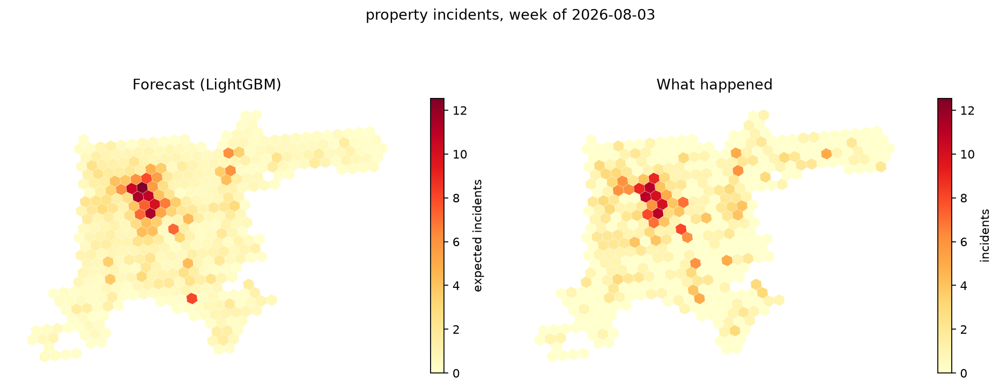
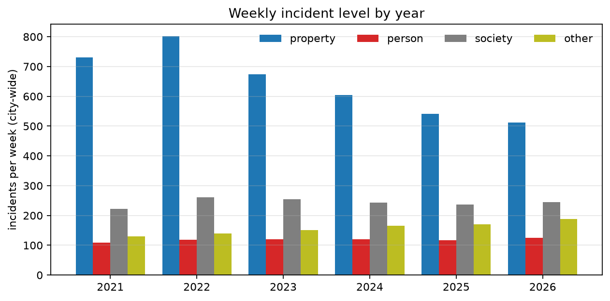
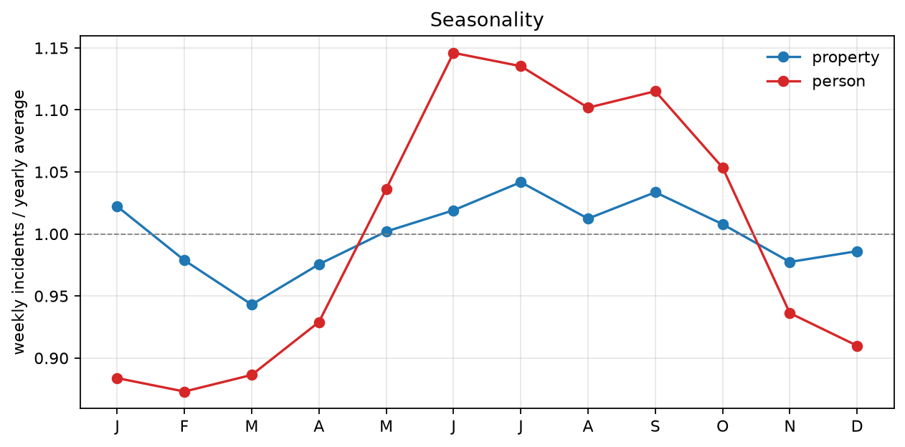
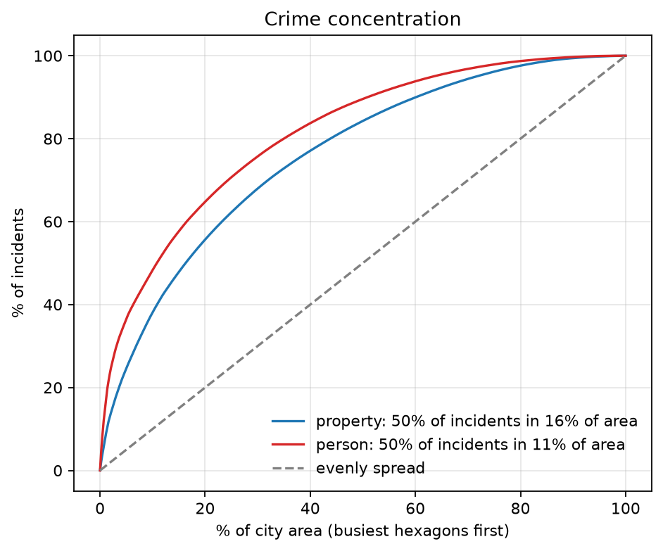
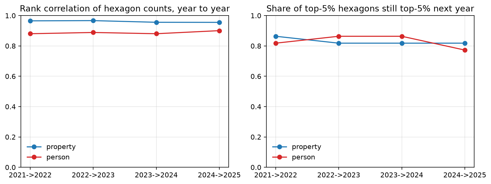
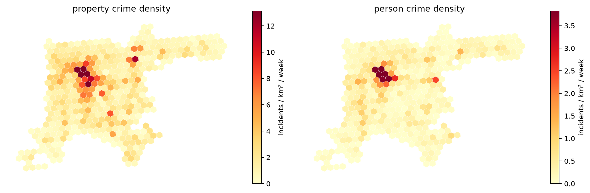
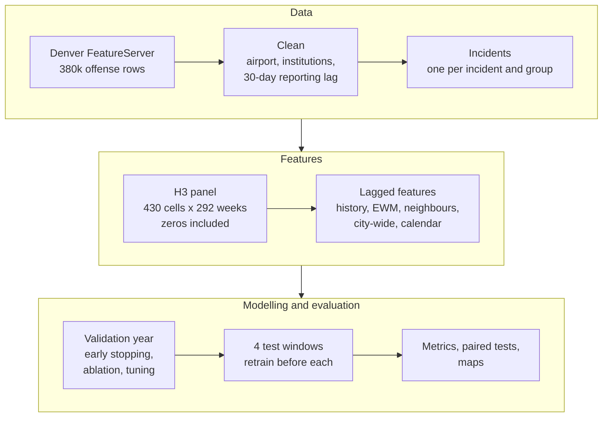
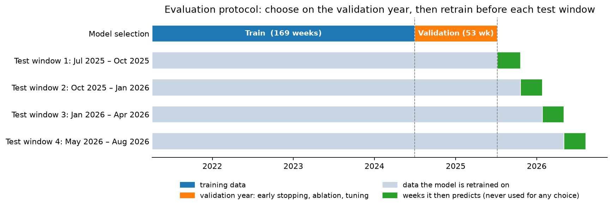
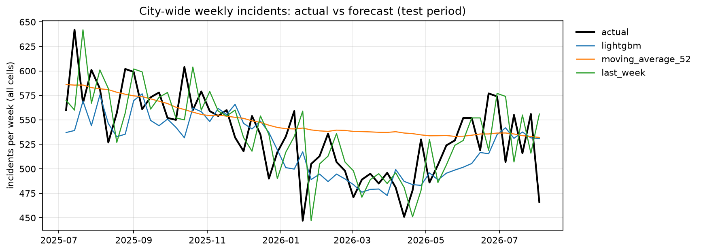
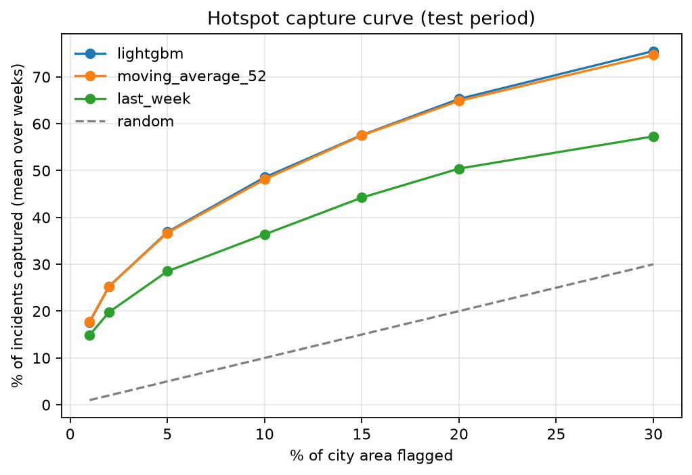

# Denver Crime Forecasting

[](https://github.com/TaimourKhan2132/DenverCrime/actions/workflows/tests.yml)


**Weekly crime forecasts for every ~0.74 km² hexagon of Denver, built from 380,000 police
records and evaluated like a real forecasting system:** strictly on future weeks, retrained
before each test window, against six naive baselines, with hotspot metrics from the
crime-forecasting literature.



## Key findings

| | |
|---|---|
| **Property crime** | LightGBM beats all six baselines in **every one of four test windows**: 2.4% lower Poisson deviance than the 52-week average, better in 48 of 57 weeks (95% CI excludes zero). |
| **Crimes against people** | A cell's **long-run historical average is as good as the ML model** (tie: 29/57 weeks, CI includes zero). These hotspots are so persistent that history is the forecast. |
| **Hotspots** | Flagging the top 5% of the city's area captures **29% of property** and **37% of person** incidents each week: 6–7× random. |
| **Data cleaning matters** | 23,129 records at the airport, police HQ, two jails and the trauma centre were removed. They were inflating person-crime hotspot scores by about 25% (PAI at 1% of area 18.9 → 15.2). |
| **A data bug** | The city's CSV export shifts two of three timestamps by exactly **+7 hours**. Found, measured and corrected automatically. |
| **Ceiling** | The final model is within 9% (property) and 3% (person) of the error that pure randomness alone would produce. Extra features and tuning improved the validation year, but not the test windows. |

## Contents

1. [The question](#1-the-question)
2. [Data and cleaning](#2-data-and-cleaning)
3. [What the data shows](#3-what-the-data-shows)
4. [Method](#4-method)
5. [Results](#5-results)
6. [Limitations](#6-limitations)
7. [Reproduce it](#7-reproduce-it)
8. [Project structure and tests](#8-project-structure-and-tests)
9. [Responsible use](#9-responsible-use)

---

## 1. The question

> Given everything reported up to last week, how many **property** and **person** crime
> incidents will happen in each hexagon of Denver next week, and which hexagons should be
> flagged as hotspots?

| Choice | Value | Why |
|---|---|---|
| Spatial unit | H3 hexagon, resolution 8 (~0.74 km², 430 cells) | Equal-area cells make hotspot metrics fair; hexagons have uniform neighbours |
| Time unit | Monday–Sunday week, 292 weeks | Smooths day-of-week noise; a natural planning horizon |
| Horizon | 1 week ahead | Every input for week *t* uses data up to week *t − 1* only |
| Targets | `property` (theft, burglary, vehicle crime, arson), `person` (assault, robbery, homicide) | Mostly victim-reported; see [Responsible use](#9-responsible-use) |
| Unit of count | Incidents, not offense rows | One event with three offenses counts once |

## 2. Data and cleaning

**Source:** Denver Open Data Catalog,
[Crime](https://opendata-geospatialdenver.hub.arcgis.com/datasets/geospatialDenver::crime/about):
NIBRS offenses for the previous five calendar years plus the current year, updated Monday–Friday,
served by an ArcGIS FeatureServer. The snapshot used here was downloaded 2026-09-18:
**379,705 offense rows**, 2021-01-01 to 2026-09-14.

### Cleaning steps

| Step | Offense rows left |
|---|---|
| Raw snapshot | 379,705 |
| Valid coordinates inside Denver | 379,506 |
| Airport neighbourhood removed | 360,684 |
| Four institutional addresses removed | 356,377 |
| Occurred 2021-01-04 to 30 days before the snapshot | 351,132 |

These rows collapse into **341,954 incident-group records**, one per incident and crime group.

### Places where crime is recorded, not committed

The busiest addresses in the data were checked one by one. Four are institutions where offenses
are *processed or reported*, and one neighbourhood is the airport:

| Place | Offense rows | Evidence | Why excluded |
|---|---|---|---|
| Denver International Airport (`dia` neighbourhood) | 18,822 | 5% of all incidents; parking-lot theft | Not a neighbourhood; its own dynamics would dominate the hotspot rankings |
| 1331 N Cherokee St: [Denver Police HQ](https://www.yelp.com/biz/denver-police-headquarters-denver) | 1,364 | 95% "all-other-crimes" | Reports and warrants processed at the station |
| 490 W Colfax Ave: [Downtown Detention Center](https://denverjail.org/downtown-detention-center-denver-colorado/) | 1,862 | 63% crimes against persons | Offenses inside a jail are not street crime |
| 10500 E Smith Rd: [Denver County Jail](https://www.globaldetentionproject.org/countries/americas/united-states/detention-centres/546/denver-county-jail) | 253 | 68% crimes against persons | Same |
| 777 N Bannock St: [Denver Health, Level I trauma centre](https://www.denverhealth.org/locations/denver/trauma-777-bannock-st-pavilion-a-denver-80204) | 828 | Person crimes and disorder | Victims reported at the hospital, not where it happened |

The six district police stations were checked too. They have only 29–97 records each, with a
mixed crime profile, so they were kept. All exclusions live in
[`configs/default.toml`](configs/default.toml) with their reasons, and each is counted in the
preparation report.

### Other data issues handled

- **Hub CSV timestamps are shifted.** The CSV download reports `FIRST_OCCURRENCE_DATE` and
  `REPORTED_DATE` exactly 7 h later than the API, while `LAST_OCCURRENCE_DATE` is not shifted.
  This was verified on sampled records. As a result, many incidents "end before they start". The
  downloader uses the API, and the CSV loader detects the shift from ordering violations and undoes it.
- **One incident, several offenses.** Rows are offenses, and in a 2020–2025 extract 11% of rows
  belonged to multi-offense incidents. Counting rows would double-count events.
- **Recent weeks are still filling in.** About 3% of incidents are reported more than 30 days
  after they happen, so the last 30 days before the snapshot are dropped.
- **Long occurrence windows.** 10,434 offenses (3%) span more than 7 days, for example a
  burglary of a vacant house. They are counted in the week they started, and reported.
- **Rolling source window.** The oldest year drops out every January, so every snapshot is
  saved with a metadata file recording when it was downloaded.

## 3. What the data shows

Run `python -m denvercrime explore` to regenerate these figures.

| Property crime fell by a third, person crime did not | Person crime is seasonal, property crime is not |
|---|---|
|  |  |
| Weekly property incidents: 802 (2022) → 541 (2025), **−33%**. Person crime stayed between 108 and 125 per week. | Person crime peaks in June (+15%) and bottoms in February (−13%). Property crime moves within ±6%. |

| Crime is concentrated | ...and the hotspots stay put |
|---|---|
|  |  |
| Half of all property incidents happen in **16%** of the city's area; half of person incidents in **11%**. | Year-to-year rank correlation of hexagon counts is **0.96** (property) and **0.89** (person), and 77–86% of the top-5% hexagons are still top-5% the next year. |



These results explain the rest of the project: when hotspots barely move, a long-run average is
already a strong forecast, and any model has to beat it.

## 4. Method

### 4.1 Pipeline



### 4.2 Features

Everything is computed from counts up to the previous week. A perturbation test changes the
future and checks that no feature moves (see [4.6](#46-leakage-safeguards)).

| Group | Features (per crime group) | Used for |
|---|---|---|
| History | lags 1–4 and 52 weeks; 4/13/26/52-week means; expanding mean | both |
| Smoothed history | exponentially weighted means, half-lives 4/13/52 weeks | both |
| Spatial | neighbours' (H3 ring 1) last-week count and 4-week mean | both |
| City-wide | last week's city total | both |
| Other crime groups | all of the above, built from the other groups' counts | person only |
| Calendar and location | week-of-year sine/cosine, month; hexagon centroid | both |
| Tested and dropped | trend ratios (4- and 13-week vs 52-week level), outer ring (H3 ring 2), federal holidays | neither |

The final property model uses **21 features**; the person model uses 69.

### 4.3 Models

- **LightGBM**, one model per target, **Tweedie** objective (variance power ~1.2) chosen by tuning.
  It suits counts that are a bit more variable than Poisson; the residual variance-to-mean
  ratio is 1.27 for property.
- **Six baselines:** last week, 4/13/52-week moving averages, same week last year, and the cell's
  historical mean. The 52-week average is the classic "historical hotspot" benchmark.

### 4.4 Evaluation protocol



1. **Validation year (Jul 2024 – Jun 2025):** every choice is made here: number of boosting
   rounds, which feature groups to keep, and the hyperparameters.
2. **Test (57 weeks, Jul 2025 – Aug 2026), split into 4 windows of about a quarter each.**
   Before each window the model is retrained on *all* earlier weeks and then predicts that
   window, as a deployed model retrained quarterly would. The test weeks are never used for any
   decision.
3. **Paired week-by-week comparison:** for each test week, the model's error minus a baseline's
   error, with a 95% bootstrap CI over weeks. Weeks are the independent unit, not the
   thousands of correlated cell-weeks.

### 4.5 Model selection (validation year only)

**Ablation:** the change in validation Poisson deviance when a feature group is removed.
Positive means the group helps. Seed-to-seed noise is ±0.0003.

| Removed group | Property | Person | Decision |
|---|---|---|---|
| Smoothed history (EWM) | **+0.0028** | 0.0000 | keep |
| City-wide | +0.0038 | +0.0005 | keep |
| Spatial (ring 1) | +0.0017 | +0.0002 | keep |
| Location / calendar | +0.0018 / +0.0014 | +0.0008 / +0.0004 | keep |
| Other crime groups | **−0.0021** | **+0.0008** | drop for property only |
| Trend ratios | −0.0018 | 0.0000 | drop |
| Outer ring / holidays | +0.0003 / +0.0004 | −0.0003 / −0.0006 | drop (noise) |

| Validation deviance | Property | Person |
|---|---|---|
| First-version feature set (57 features) | 1.1320 | 0.5955 |
| All 86 candidate features | 1.1316 | 0.5951 |
| Selected features | 1.1272 (21 features) | 0.5951 (69) |
| + tuned hyperparameters (Optuna, 40 trials) | **1.1250** | **0.5945** |

The first three rows are means over 3 random seeds; the tuned row is the best Optuna trial.

**Tried and rejected** (no gain beyond noise on validation): averaging 5 random seeds, and
blending LightGBM with the 52-week average (every blend weight within 0.0003).

### 4.6 Leakage safeguards

Each safeguard has a test, and the tests were checked by deliberately injecting leaks: each
injected leak made its test fail.

| Safeguard | Test |
|---|---|
| Features for week *t* never use week *t* or later | `test_no_feature_sees_the_current_or_future_weeks`: perturbs the future at week 30 **and** week 80, so 52-week features are checked too |
| Cells are chosen from the training period only | `test_cell_selection_ignores_the_future` |
| Train, validation and test windows are ordered and disjoint | `test_temporal_split_and_test_windows` |
| Each test window is predicted by a model trained only on earlier weeks | `test_backtest_and_maps` |
| Target columns are never features | `test_prepare_writes_features` |
| Offenses are deduplicated to incidents | `test_incidents_count_once_per_group` |

## 5. Results

All numbers are from the 57-week test period, pooled over the four windows, and from
`outputs/runs/<timestamp>/metrics.md`. Runs are deterministic.

### 5.1 Headline

**Property crime** (mean 1.25 incidents per hexagon-week)

| Predictor | Poisson dev. ↓ | MAE ↓ | ROC-AUC ↑ | F1 ↑ | Accuracy ↑ | Hit rate @5% ↑ | PAI @5% ↑ |
|---|---|---|---|---|---|---|---|
| **LightGBM** | **1.052** | **0.809** | **0.827** | 0.737 | **73.8%** | **29.4%** | **5.74** |
| 52-week average | 1.078 | 0.822 | 0.824 | 0.740 | 73.6% | 29.0% | 5.68 |
| 13-week average | 1.297 | 0.820 | 0.813 | 0.723 | 72.8% | 29.2% | 5.72 |
| Historical mean | 1.188 | 0.927 | 0.823 | **0.754** | 71.5% | 27.9% | 5.46 |
| Last week | 10.709 | 1.004 | 0.715 | 0.675 | 67.3% | 26.0% | 5.08 |

**Crimes against people** (mean 0.29 incidents per hexagon-week)

| Predictor | Poisson dev. ↓ | MAE ↓ | ROC-AUC ↑ | F1 ↑ | Accuracy ↑ | Hit rate @5% ↑ | PAI @5% ↑ |
|---|---|---|---|---|---|---|---|
| **LightGBM** | **0.600** | 0.314 | **0.810** | 0.364 | **83.8%** | 36.9% | 7.21 |
| Historical mean | 0.602 | 0.313 | 0.808 | 0.339 | **83.8%** | **37.0%** | **7.24** |
| 52-week average | 0.653 | **0.311** | 0.803 | 0.369 | 83.6% | 36.7% | 7.18 |
| 13-week average | 1.134 | 0.315 | 0.778 | 0.375 | 83.4% | 35.8% | 7.00 |
| Last week | 6.077 | 0.351 | 0.624 | **0.379** | 76.5% | 28.5% | 5.57 |

How to read the metrics:
- **Poisson deviance** is the main score for count forecasts.
- **Accuracy, F1 and ROC-AUC** answer the yes/no question "will this hexagon have at least one
  incident?" using P(count ≥ 1) = 1 − e^(−forecast). Always guessing the majority answer scores
  50.2% (property) and 81.1% (person), so person-crime accuracy looks high only because most
  hexagon-weeks have none. F1 at a fixed 0.5 threshold rewards over-prediction, which is why
  the historical mean (which over-forecasts after the property decline) has the top property F1.
- **Hit rate** is the share of the week's incidents inside the flagged 5% of the area.
  **PAI** is hit rate divided by area share (Chainey et al., 2008).

### 5.2 Is the difference real? Paired weekly comparison

| Target | LightGBM vs | Mean weekly deviance difference | 95% CI | Weeks LightGBM better |
|---|---|---|---|---|
| property | 52-week average | −0.026 | [−0.035, −0.019] | **48 / 57** |
| property | historical mean | −0.137 | [−0.150, −0.123] | 57 / 57 |
| person | 52-week average | −0.053 | [−0.070, −0.038] | 46 / 57 |
| person | historical mean | −0.002 | [−0.005, +0.001] | **29 / 57 (tie)** |

### 5.3 Consistency across the four test windows

| Poisson deviance | Window 1 (Jul–Oct 25) | Window 2 (Oct 25–Jan 26) | Window 3 (Jan–Apr 26) | Window 4 (May–Aug 26) |
|---|---|---|---|---|
| Property, LightGBM | **1.102** | **1.040** | **1.032** | **1.030** |
| Property, 52-week average | 1.126 | 1.066 | 1.055 | 1.063 |
| Person, LightGBM | 0.599 | 0.583 | 0.588 | **0.631** |
| Person, historical mean | 0.599 | 0.582 | 0.584 | 0.643 |

For property crime the ranking is stable: LightGBM wins every window. For person crime,
LightGBM and the historical mean trade places.

### 5.4 Did the extra features and tuning help?

Two comparison runs isolate the effect of each change; the configs are included.

| Comparison | Property | Person |
|---|---|---|
| Final model vs first-version model, same data and windows ([`compare_v1_model.toml`](configs/compare_v1_model.toml)) | −0.0004, CI [−0.003, +0.002]: **tie** | +0.0001, CI [−0.001, +0.001]: **tie** |
| Top-1% hotspot capture, cleaned vs uncleaned data ([`compare_uncleaned.toml`](configs/compare_uncleaned.toml)) | 9.8% vs 9.3% | **17.7% vs 20.7%** |

The validation-year gains (0.4% for property) **did not carry over to the test windows**. That
is expected when a model is this close to the noise floor, and it is why the test period was
never used to choose between them. The final model is kept because the validation year chose
it, and it reaches the same accuracy with 21 features instead of 57. Cleaning, on the other
hand, removed places that made person-crime hotspots look more predictable than they are.

### 5.5 Diagnostics

| City-wide weekly totals (property) | Hotspot capture curve (person) |
|---|---|
|  |  |
| LightGBM follows the property-crime decline; the 52-week average lags behind it. | The model and the 52-week average select almost the same hotspots. |

**What the models rely on** (share of LightGBM gain):
- property: 13-week EWM 63%, 4-week EWM 15%, expanding mean 14%
- person: expanding mean 62%, 13-week EWM 14%, society-group expanding mean 8%

Recent level drives property forecasts; long-run level drives person forecasts.

## 6. Limitations

- **The noise floor.** A hexagon averages 1.25 property and 0.29 person incidents a week, and 28%
  and 46% of the week-to-week variance is pure Poisson randomness. The final model's deviance is
  9% (property) and 3% (person) above the level a *perfect* rate estimate would have with that
  randomness. Large accuracy gains at this resolution are not available to any method. A claim
  of large gains here would more likely point to leakage.
- **Recorded crime is not all crime.** Reporting rates differ by neighbourhood and offense type.
- **Locations are block-level:** 87,872 distinct points for 355k incidents.
- **One city, one snapshot.** The source drops its oldest year every January, so results will
  shift slightly with each new download.
- **Weekly horizon only.** Daily or shift-level forecasts and other hexagon sizes were not studied.

## 7. Reproduce it

Windows / PowerShell. The environment is kept outside OneDrive, and no script activation is needed.

```powershell
py -3.11 -m venv $HOME\.venvs\denvercrime
$py = "$HOME\.venvs\denvercrime\Scripts\python.exe"
& $py -m pip install -e ".[dev]"
& $py -m pytest                           # 50 tests on synthetic data, no download needed
```

```powershell
& $py -m denvercrime download             # ~380k rows from the FeatureServer, ~4 minutes
& $py -m denvercrime prepare              # clean -> panel -> 86 candidate features
& $py -m denvercrime explore              # section 3 figures
& $py -m denvercrime ablate               # section 4.5, validation year only
& $py -m denvercrime tune                 # Optuna, validation year only -> overrides.toml
& $py -m denvercrime backtest             # 4 rolling test windows -> outputs/runs/<timestamp>/
& $py -m denvercrime maps                 # interactive + static maps, diagnostic plots
# comparison runs (section 5.4)
& $py -m denvercrime --config configs/compare_v1_model.toml prepare
& $py -m denvercrime --config configs/compare_v1_model.toml backtest
```

On macOS/Linux, use `python -m denvercrime ...` inside any Python 3.11 environment. You can also
place a Hub CSV export in `data/raw/`: `prepare` picks it up and corrects the timestamp shift.

**Each run writes** `metrics.md` (all tables: pooled, per window, paired, validation),
`summary.json`, test predictions for every predictor, feature importance, LightGBM models in
their native text format (no pickle), the evaluation-timeline figure, an interactive folium map,
and PNG figures.

## 8. Project structure and tests

```
configs/
  default.toml               every setting, the exclusion list with reasons, tuned parameters
  compare_*.toml             comparison experiments (extend default.toml)
src/denvercrime/
  data/        download.py   FeatureServer keyset pager, retries, snapshot metadata
               load.py       schema checks, CSV timestamp-shift detection
               clean.py      filters, airport/institution exclusion, incident deduplication
  features/    spatial.py    H3 cells, neighbour matrices
               panel.py      complete cell x week panel with zeros
               build.py      leakage-safe features, feature groups
  models/      gbm.py        LightGBM fit / refit / predict
               baselines.py  six naive forecasters
  evaluation/  metrics.py    deviance, MAE, accuracy/F1/AUC, hit rate, PAI, PEI, paired test
               backtest.py   validation year + rolling test windows
               selection.py  ablation and Optuna tuning (validation only)
  viz/         explore.py    trends, seasonality, concentration, stability
               maps.py       folium and matplotlib hexagon maps, diagnostics
  pipeline.py, cli.py
tests/                       50 tests, synthetic data shaped like the real layer
.github/workflows/tests.yml  runs the tests on every push
```

## 9. Responsible use

Crime forecasts can create feedback loops: patrols go where the model points, more crime is
*recorded* there, and the next forecast points there again. This project limits that risk:

- **Targets are mostly victim-reported crime.** Drug/alcohol and public-disorder offenses are
  largely discovered through police activity, so forecasting them mostly forecasts enforcement.
  They are used only as inputs, not as targets.
- **Places and weeks, never people.** No information about offenders or victims is used.
- **Reporting artefacts removed.** Jails, police HQ and the trauma centre would otherwise look
  like permanent "hotspots".
- **Honest baselines.** For crimes against people, a simple long-run average does as well as the
  model, and the results say so.

It's intended for analysis and research, such as resource planning or studying how persistent
hotspots are, and not as the sole basis for enforcement decisions.

---

**Author:** Taimour Khan · Data: City and County of Denver Open Data Catalog (see their terms of use)
